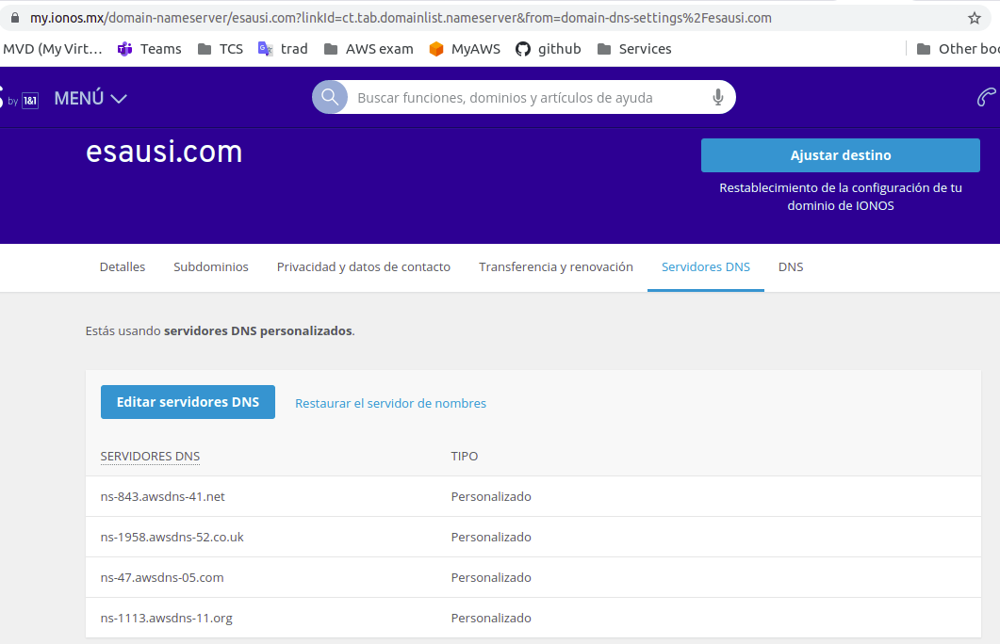
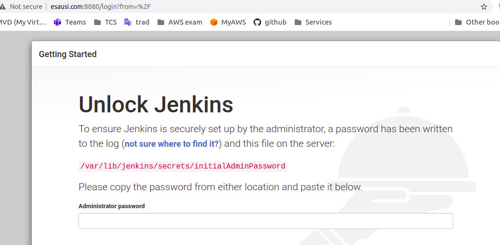

# Create a DNS domain name
Reference
https://medium.com/@kcabading/getting-a-free-domain-for-your-ec2-instance-3ac2955b0a2f

Steps
- Create/buy a Domain Name on: https://www.ionos.mx/    "esausi.com"
- Create DNS Zone on Route 53 using domaina name from previous step "esausi.com"
- Copy DNS names from Route53
ns-47.awsdns-05.com.
ns-1958.awsdns-52.co.uk.
ns-1113.awsdns-11.org.
ns-843.awsdns-41.net.
- Create an Web App on a EC2 instance
- Create 2 records on Route53, one www and another "", point both to the created EC2 instance
- Go to ionos and update the 4 DNS name servers of the DNS Name to the AWS DNS Server names

Once updated, try to access the DNS
http://esausi.com:8080
http://www.esausi.com:8080

All working as expected

TTL is 1hrs, lets see if it is updated during the day
