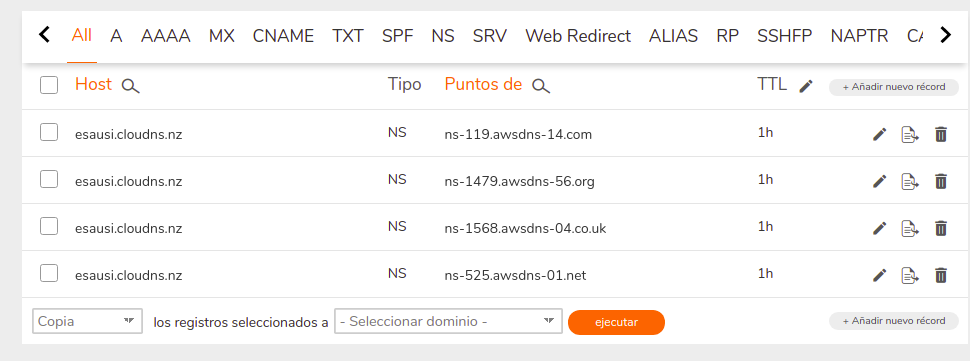

# Create a DNS domain name
Reference
https://medium.com/@kcabading/getting-a-free-domain-for-your-ec2-instance-3ac2955b0a2f

Steps
- Create Domain Name on: ClouDNS.com
- Create DNS Zone on Route 53 using domaina name from previous step
- Copy DNS names from Route53
ns-525.awsdns-01.net.
ns-1568.awsdns-04.co.uk.
ns-1479.awsdns-56.org.
ns-119.awsdns-14.com.
- Create an Web App on a EC2 instance
- Create 2 records on Route53, one www and another "", point both to the created EC2 instance
- Go to ClouDNS and update the 4 DNS name servers of the DNS Name to the AWS DNS Server names

Once updated, try to access the DNS
http://esausi.cloudns.nz
http://www.esausi.cloudns.nz

Until now, not working, https://www.cloudns.net/records/domain/3442135/

TTL is 1hrs, lets see if it is updated during the day
