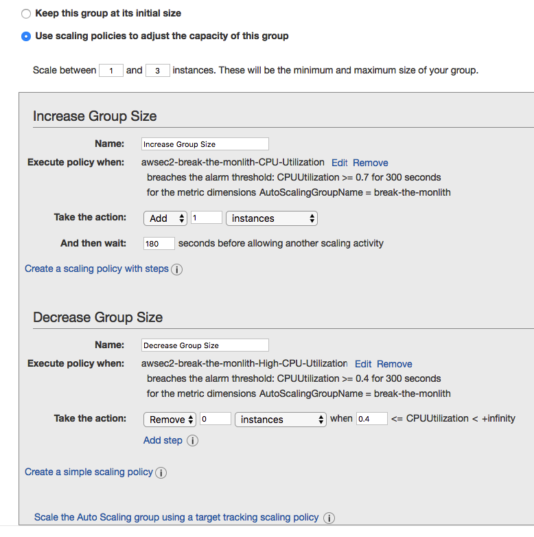

# AutoScalling application

For enable the autoscaling capability on our web app running over EC2, it is required give autoscaling capabilities to every layer of the app,
- Balancer
- Web application
- Database

## AutoScaling web app

For allow Autoscaling works in our Web app, it is required to kmove the files to a central service and not keep it on the instance,
- EFS: NFS mounted directly to the EC2 instance
- S3: Object storage designed to deliver 99.9x9% durability

When we need to scale up, it is better to crate an image with all the software and configuration files installed, and then insert the parameter or the configuration files that need to be pased at runtime to the user_data

Steps for create an image,
- Stop the EC2 instance
- Properties -> Image -> Create image
  Image name: break-the-monolith
  Image description: the image will be use in a launch configuration

  In a short period of time, our 8Gb image will be ready

Scallable application 

## Setup autoscaling in AWS EC2

Objects required,
- Launch configuration
- Auto scaling group

Click on Auto scaling groups option and an automatic wizard will then start to create the necessary resources
- Launch configuration
  My AMIs: Select image previously created and Next
  Name: break-the-monolith 

- Auto Scalling group 
  Group name: break-the-monolith
  Group size: start with 1
  Network: Chose the VPC
  Subnet: Chose any set of subnets

- Security group
  Chose the EC2 instance SG

- Key pair
  Use our previously created Key pair

- Create auto scaling group
  Scaling policies: We are going to create policies following this conditions,
  - If the CPU usage is below 70% for more than 5 minutes, add 1 instance
  - If the CPU usage is lower than 40% for more than 5 minutes, remove 1 instance
  - Create two alarms and asociate this to the ASG
    
  Select: Use scaling policies to adjust the capacity ot this group

   

### Modifying the Auto Scaling Group

