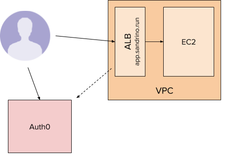
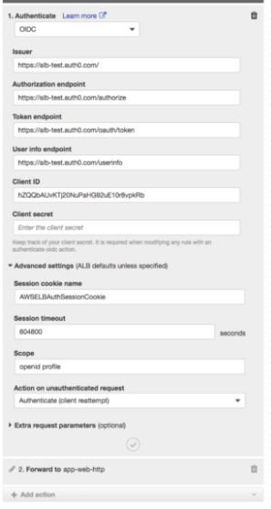
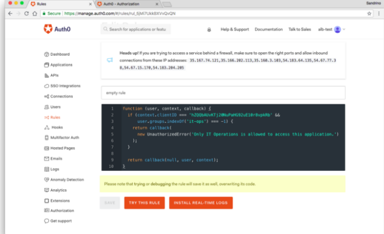

# Auth0

Auth0 is a cloud service for manage users on multiplatform apps in an homogeneous way

Reference,
- https://medium.com/@sandrinodm/securing-your-applications-with-aws-alb-built-in-authentication-and-auth0-310ad84c8595

Other references,
- Authentication on custom WebApp: https://docs.aws.amazon.com/elasticloadbalancing/latest/application/listener-authenticate-users.html

## Use case
Exampe app in AWS exposed using ALB https://app.sandrino.run using SSL (HTTPS with certificate)

Only authenticated requests should be sent to the instance, which is where Built-in Authentication comes in. If the user is not authenticated they will be sent to Auth0 (the identity provider, IdP). This leverages the OIDC Authorization Code flow. After the user has logged in to the IdP, they will be redirected back to the ALB with the authorization code (https://app.sandrino.run/oauth2/idpresponse?code=…). The ALB will complete the transaction by executing the code exchange (by calling the token endpoint of the IdP).

If the transaction is successfully completed the ALB will create a session and further requests to https://app.sandrino.run will be authenticated, allowing them to be proxied to the EC2 instance.

## Set up 

Steps for set up authentication using Auth0 Built in authentication,
- To have Web app without authentication on EC2 instances
- Create a ALB, with HTTPS pointing to the Web App
- Register on Auth0, https://manage.auth0.com/ and create an application (Regular Web Application)
  -  Configure "Allowed Callback URL", pointing to the ALB endpoint using this format: https://your-application/oauth2/idpresponse
- Add a rule for the HTTPS listener in ALB

  Add an “Authenticate” step before the “Forward to” step, requiring all requests to be authenticated first. Configuring it will require you to fill in the following settings:
    Issuer: https://your-domain/
    Authorization Endpoint: https://your-domain/authorize
    Token Endpoint: https://your-domain/oauth/token
    User Info Endpoint: https://your-domain/userinfo
    Client ID and Client Secret of your Auth0 Application
    Scope: the scopes you can use to request specific sets of information as described by the OIDC specification. The openid profile scope will give you the full user profile

    

    