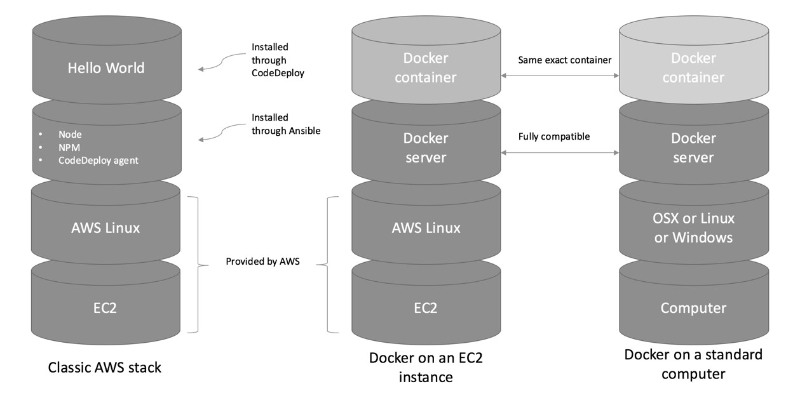
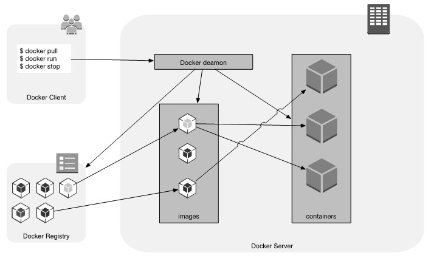

# Docker
Isolation features, including Union Capable Filesystem
Containers like VM are self-contained, but they virtualize the OS itself, instead of virtualizing the hardware.
VM starting, the hypervisor has to simulate all of the motions involved in starting a physical server, loading operating system, and foing through the diferent run-levels. And have a much larger footprint on the disk and in memory. 

**Concepts**
Images: templates describing the stack of the application, including the operating system, application code, and everything in between

Docker comparison


Docker architecture


At its core, Docker runs a daemon that loads images (templates describing the stack of the application, including the operating system, application code, and everything in between) and runs them in self-contained directories called containers. When working in Docker, as a developer, your work mostly consists of building new images by layering new commands on top of pre-existing images. Images are stored in external registries. Those registries can be public or private. Finally, all the interaction is done through a RESTful API, usually using the command-line interface.

- /var/lib/docker        here are images, containers, volumes, networks

## Installation
Reference,
- https://docs.docker.com/engine/install/ubuntu/

Steps,
- Get Ubuntu version
- Uninstall previous versions
- Configure the docker repository
- Add docker's official GPG key
- Setup stable repository
- Install docker engine
- Test docker with a hello world example

```js
%> lsb_release -a
No LSB modules are available.
Distributor ID: Ubuntu
Description:    Ubuntu 20.04.3 LTS
Release:        20.04
Codename:       focal

%> sudo apt-get remove docker docker-engine docker.io containerd runc

%> sudo apt-get update

%> sudo apt-get install \
    apt-transport-https \
    ca-certificates \
    curl \
    gnupg \
    lsb-release

%> curl -fsSL https://download.docker.com/linux/ubuntu/gpg | sudo gpg --dearmor -o /usr/share/keyrings/docker-archive-keyring.gpg

%> echo \
  "deb [arch=$(dpkg --print-architecture) signed-by=/usr/share/keyrings/docker-archive-keyring.gpg] https://download.docker.com/linux/ubuntu \
  $(lsb_release -cs) stable" | sudo tee /etc/apt/sources.list.d/docker.list > /dev/null

%> sudo apt-get update
%> sudo apt-get install docker-ce docker-ce-cli containerd.io

%> sudo docker run hello-world

Hello from Docker!
This message shows that your installation appears to be working correctly.

To generate this message, Docker took the following steps:
 1. The Docker client contacted the Docker daemon.
 2. The Docker daemon pulled the "hello-world" image from the Docker Hub.
    (amd64)
 3. The Docker daemon created a new container from that image which runs the
    executable that produces the output you are currently reading.
 4. The Docker daemon streamed that output to the Docker client, which sent it
    to your terminal.

To try something more ambitious, you can run an Ubuntu container with:
 $ docker run -it ubuntu bash

Share images, automate workflows, and more with a free Docker ID:
 https://hub.docker.com/

For more examples and ideas, visit:
 https://docs.docker.com/get-started/

```

## Uninstall docker engine
Steps,
- Size ocuppied
- Uninstall docker engine
- Delete all images, containers, and volumes

```js
%> sudo du -hs /var/lib/containerd/
168K    /var/lib/containerd/
%> sudo du -hs /var/lib/docker/
1.7G    /var/lib/docker/

%> sudo apt-get purge docker-ce docker-ce-cli containerd.io

%> sudo rm -rf /var/lib/docker
%> sudo rm -rf /var/lib/containerd

```

## Docker versions
- Community Edition (CE)
- Enterprise Edition (EE)

## Docker commands

```js
%> docker --version
Docker version 20.10.9, build c2ea9bc

%> docker pull IMAGE_NAME

%> docker images

%> docker run IMAGE_NAME echo "Hello World" Hello World 

# Starting and interactive shell
# -i means interactive
# -t means pseudo TTY, see what we are typing and the output of commands
%> docker run -it IMAGE_NAME /bin/sh

# Start in background
# -d means detached instance
%> docker run -d IMAGE_NAME sleep 1000
%> docker ps 

# Stop a container
%> docker ps
CONTAINER ID   IMAGE     COMMAND        CREATED          STATUS          PORTS     NAMES
5f8c212232f7   alpine    "sleep 1000"   13 seconds ago   Up 12 seconds             vigilant_carson
%> docker stop {CONTAINER_ID | NAMES}
%> docker stop vigilant_carson
%> docker stop 5f8c212232f7
%> docker ps

$ Remove a container
%> docker ps
%> docker ps --all
%> docker stop {CONTAINER_ID | NAMES}
%> docker rm {CONTAINER_ID | NAMES}
```