# Package our image on a Docker Container

References,
https://github.com/yogeshraheja/helloworld/blob/master/helloworld.js
https://github.com/yogeshraheja/helloworld/blob/master/package.json
https://github.com/yogeshraheja/helloworld/blob/master/Dockerfile
https://github.com/yogeshraheja/EffectiveDevOpsTemplates/blob/master/ecr-repository-cf-template.py
https://github.com/yogeshraheja/EffectiveDevOpsTemplates/blob/master/ecs-cluster-cf-template.py
https://github.com/yogeshraheja/EffectiveDevOpsTemplates/blob/master/helloworld-ecs-alb-cf-template.py
https://github.com/yogeshraheja/EffectiveDevOpsTemplates/blob/master/helloworld-ecs-service-cf-template.py
https://github.com/yogeshraheja/EffectiveDevOpsTemplates/blob/master/helloworld-codebuild-cf-template.py
https://raw.githubusercontent.com/yogeshraheja/EffectiveDevOpsTemplates/master/helloworld-ecs-service-cf-template.py
https://github.com/yogeshraheja/EffectiveDevOpsTemplates/blob/master/helloworld-codepipeline-cf-template.py

## Services to use
- Docker
- EC2
- [ECS (Summary of service)](./AWSECSCluster.md)
- ALB
- CodeBuild
- CodePipeline

### ECS with Fargate example reference,
https://github.com/1Strategy/fargate-cloudformation-example/blob/master/fargate.yaml

Changes required,
- AWS::ECS::Service needs to specify LaunchType: FARGATE
- AWS::ECS::TaskDefinition needs to specify RequiresCompatibilities: - FARGATE

All Network configuration previously was added to EC2 instance now is part of the AWS::ECS::Service

## Docker Installation
Documentation for docker installation [here](./DockerInstallationOnUbuntu.md)

## Application dockerization
Reference,
- Official AWS Docker image. You can read more about this at http://amzn.to/2jnmklF.

Steps
- Pull alphine image from docker registry
- Run a container
- Search the image to be used on cli or web (https://hub.docker.com/_/node/.)
- Create a Dockerfile on helloworld project, on "dockerized" branch
- Build the image
- Run a docker from the created image
- Validate in logs container is running and using curl
- Kill the container

Detail [here](./DockerizingApplication.md)

## ECS

In a general way we require,
- Create a Registry
- Upload the docker image
- Create a ECS Cluster
- Create a Load balancer
- Create a Container 
  - Using the Image from the Registry and deploying the image on the ECS Cluster
  - Test the Container using the Load balancer
All this steps were automate on [startEnv.sh](./startEnv.sh) shell script.


Next we can see deail step by step,

### Create a ECR repo

Steps,
- Create the Cloudformation script for the Registry 
- Create the Registry
- Get the exported variables of the stack

```js
%> cat ecr-repository-cf-template.py
%> python ecr-repository-cf-template.py > ecr-repository.yaml
%> aws cloudformation create-stack \
    --stack-name helloworld-ecr \
    --capabilities CAPABILITY_IAM \
    --template-body file://ecr-repository.yaml \
    --parameters ParameterKey=RepoName,ParameterValue=helloworld
{
    "StackId": "arn:aws:cloudformation:us-east-1:309135946640:stack/helloworld-ecr/c75036e0-30cb-11ec-a660-0a9dbbfba805"
}

%> aws ecr describe-repositories
{
    "repositories": [
        {
            "repositoryArn": "arn:aws:ecr:us-east-1:309135946640:repository/helloworld",
            "registryId": "309135946640",
            "repositoryName": "helloworld",
            "repositoryUri": "309135946640.dkr.ecr.us-east-1.amazonaws.com/helloworld",
            "createdAt": 1634641239.0,
            "imageTagMutability": "MUTABLE",
            "imageScanningConfiguration": {
                "scanOnPush": false
            },
            "encryptionConfiguration": {
                "encryptionType": "AES256"
            }
        }
    ]
}

%> aws cloudformation list-exports
{
    "Exports": [
        {
            "ExportingStackId": "arn:aws:cloudformation:us-east-1:309135946640:stack/helloworld-ecr/c75036e0-30cb-11ec-a660-0a9dbbfba805",
            "Name": "helloworld-repo",
            "Value": "helloworld"
        }
    ]
}
```

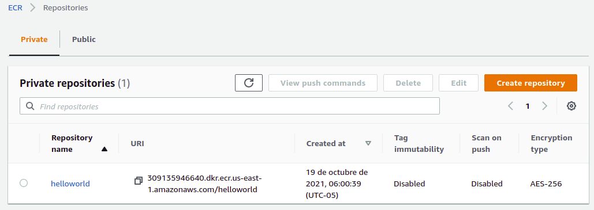

### Upload the image to ECR

Steps,
- Login to ECR
- Tag the image
- Push the image to the Registry
- Validate image is on the Registry

```js
%> eval "$(aws ecr get-login --region us-east-1 --no-include-email )"
WARNING! Using --password via the CLI is insecure. Use --password-stdin.
WARNING! Your password will be stored unencrypted in /home/armando/.docker/config.json.
Configure a credential helper to remove this warning. See
https://docs.docker.com/engine/reference/commandline/login/#credentials-store

Login Succeeded

%> cd helloworld

# Get url from "aws ecr describe-repositories" on repositoryUri, in example "094507990803.dkr.ecr.us-east-1.amazonaws.com/helloworld"
%> docker tag helloworld:latest 309135946640.dkr.ecr.us-east-1.amazonaws.com/helloworld:latest

%> docker push 309135946640.dkr.ecr.us-east-1.amazonaws.com/helloworld:latest
he push refers to repository [309135946640.dkr.ecr.us-east-1.amazonaws.com/helloworld]
6617e116c7e4: Pushed 
...
ebb9ae013834: Pushed 
latest: digest: sha256:c8ab0a196e907c14c7f334fc56c838fdff937f7285cf21f128f3c572d8582b9d size: 2840

%> aws ecr describe-images --repository-name helloworld
{
    "imageDetails": [
        {
            "registryId": "309135946640",
            "repositoryName": "helloworld",
            "imageDigest": "sha256:c8ab0a196e907c14c7f334fc56c838fdff937f7285cf21f128f3c572d8582b9d",
            "imageTags": [
                "latest"
            ],
            "imageSizeInBytes": 353822726,
            "imagePushedAt": 1634642884.0,
            "imageManifestMediaType": "application/vnd.docker.distribution.manifest.v2+json",
            "artifactMediaType": "application/vnd.docker.container.image.v1+json"
        }
    ]
}

```

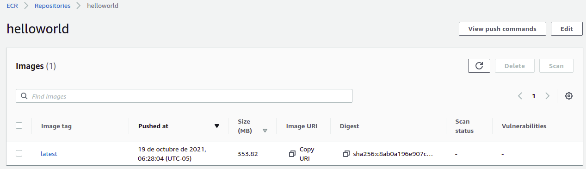

Image URI: 309135946640.dkr.ecr.us-east-1.amazonaws.com/helloworld:latest


### Creation of the ECS Cluster
ECS service provides an orchestration layer. That orchestration layer is in charge of managing the life cycle of containers, including upgrading or downgrading and scaling your containers up or down. The orchestration layer also distributes all containers for every service across all instances of the cluster optimally. Finally, it also exposes a discovery mechanism that interacts with other services such as ALB and ELB to register and deregister containers.

Instead, we are using an ECS- optimized AMI (you can read more about this at http://amzn.to/2jX0xVu) that lets us use the UserData field to configure the ECS service, and then starting it.

Containers, through the intermediary of their task definitions, set a requirement for CPU and memory. They will require, for example, 1024 CPU units, which represents one core, and 256 memory units, which means 256 MB of RAM. If the ECS instances are close to being filled up on one of those two constraints, the ECS Auto Scaling Group needs to add more instances:

ECS distribution of new containers on existing ECS instances
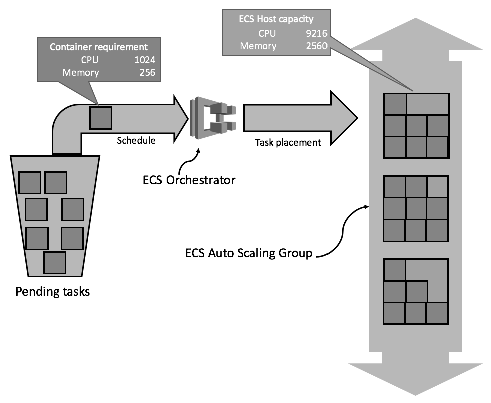

Steps,
- Create Troposphere template for the **ECS** cluster and convert to CloudFormation template
- Get VPCId and subnets for default VPC
- Create the cluster
- Create Troposphere template for the **ALB** and convert to CloudFormation template
- Create the ALB

```js
%> cat ecs-cluster-cf-template.py
...
states = {
    "High": {
        "threshold": "75",
        "alarmPrefix": "ScaleUpPolicyFor",
        "operator": "GreaterThanThreshold",
        "adjustment": "1"
    },
    "Low": {
        "threshold": "30",
        "alarmPrefix": "ScaleDownPolicyFor",
        "operator": "LessThanThreshold",
        "adjustment": "-1"
    }
}

for reservation in {"CPU", "Memory"}:
    for state, value in states.items(): #.iteritems():
        t.add_resource(Alarm(
            "{}ReservationToo{}".format(reservation, state),
            AlarmDescription="Alarm if {} reservation too {}".format(
                reservation,
                state),
            Namespace="AWS/ECS",
            MetricName="{}Reservation".format(reservation),
            Dimensions=[
                MetricDimension(
                    Name="ClusterName",
                    Value=Ref("ECSCluster")
                ),
            ],
            Statistic="Average",
            Period="60",
            EvaluationPeriods="1",
            Threshold=value['threshold'],
            ComparisonOperator=value['operator'],
            AlarmActions=[
                Ref("{}{}".format(value['alarmPrefix'], reservation))]
        ))
        t.add_resource(ScalingPolicy(
            "{}{}".format(value['alarmPrefix'], reservation),
            ScalingAdjustment=value['adjustment'],
            AutoScalingGroupName=Ref("ECSAutoScalingGroup"),
            AdjustmentType="ChangeInCapacity",
        ))

%> python ecs-cluster-cf-template.py > ecs-cluster.yaml

%> aws ec2 describe-vpcs --query 'Vpcs[].VpcId' 
[
    "vpc-e2f5139f",
]
%> aws ec2 describe-subnets --query 'Subnets[].SubnetId' 
[
    "subnet-29984808",
    "subnet-67558238",
    "subnet-e3445ddd",
    "subnet-6a0c9627",
    "subnet-586be756",
    "subnet-5ec70d38"
]

%> aws cloudformation create-stack \
    --stack-name staging-cluster \
    --capabilities CAPABILITY_IAM \
    --template-body file://ecs-cluster.yaml \
    --parameters ParameterKey=KeyPair,ParameterValue=EffectiveDevOpsAWS \
                 ParameterKey=VpcId,ParameterValue=vpc-e2f5139f \
                 ParameterKey=PublicSubnet,ParameterValue=subnet-29984808\\,subnet-67558238\\,subnet-e3445ddd\\,subnet-6a0c9627\\,subnet-586be756\\,subnet-5ec70d38
{
    "StackId": "arn:aws:cloudformation:us-east-1:309135946640:stack/staging-cluster/87a82860-30d3-11ec-8453-0e2917a1b1bd"
}

```

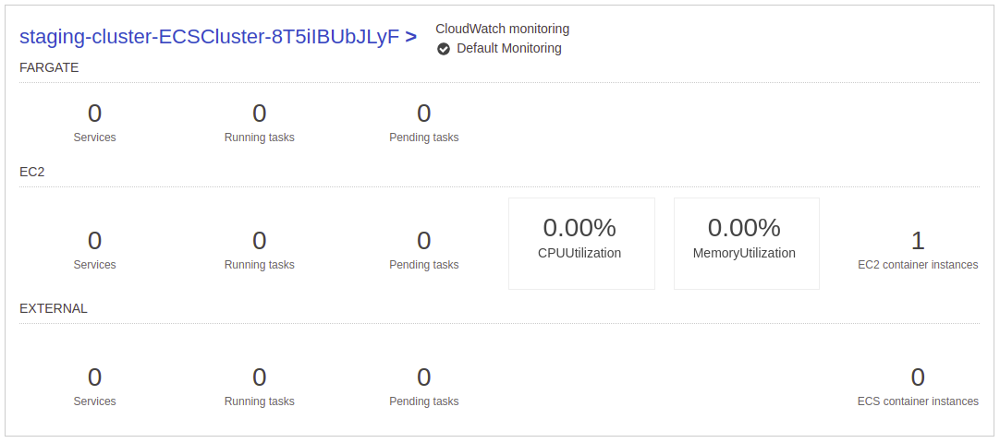

**ALB**

```js
%> cat helloworld-ecs-alb-cf-template.py
...
t.add_resource(elb.LoadBalancer(
    "LoadBalancer",
    Scheme="internet-facing",
    Subnets=Split(
        ',',
        ImportValue(
            Join("-",
                 [Select(0, Split("-", Ref("AWS::StackName"))),
                  "cluster-public-subnets"]
                 )
        )
    ),
    SecurityGroups=[Ref("LoadBalancerSecurityGroup")],
))

t.add_resource(elb.TargetGroup(
    "TargetGroup",
    DependsOn='LoadBalancer',
    HealthCheckIntervalSeconds="20",
    HealthCheckProtocol="HTTP",
    HealthCheckTimeoutSeconds="15",
    HealthyThresholdCount="5",
    Matcher=elb.Matcher(
        HttpCode="200"),
    Port=3000,
    Protocol="HTTP",
    UnhealthyThresholdCount="3",
    VpcId=ImportValue(
        Join(
            "-",
            [Select(0, Split("-", Ref("AWS::StackName"))),
                "cluster-vpc-id"]
        )
    ),
))
...

%> python helloworld-ecs-alb-cf-template.py > helloworld-ecs-alb.yaml

%> aws cloudformation create-stack \
    --stack-name staging-alb \
    --capabilities CAPABILITY_IAM \
    --template-body file://helloworld-ecs-alb.yaml
{
    "StackId": "arn:aws:cloudformation:us-east-1:309135946640:stack/staging-alb/893dd1a0-30d5-11ec-902f-1229675c6295"
}
```

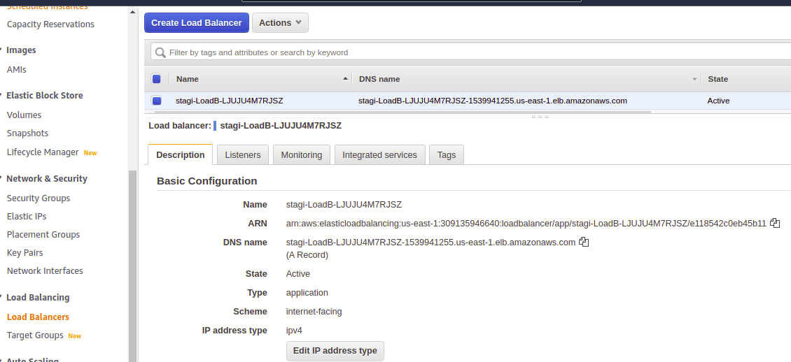

**Container** or ECS Service resource

Steps,
- Create Troposphere template for the **ECS Service** and convert to CloudFormation template
- Create the ECS Service
- Get DNS Name from the Cluster
- Test the deployment

```js
%> cat helloworld-ecs-service-cf-template.py
...
t.add_resource(TaskDefinition(
    "task",
    ContainerDefinitions=[
        ContainerDefinition(
            Image=Join("", [
                Ref("AWS::AccountId"),
                ".dkr.ecr.",
                Ref("AWS::Region"),
                ".amazonaws.com",
                "/",
                ImportValue("helloworld-repo"),
                ":",
                Ref("Tag")]),
            Memory=32,
            Cpu=256,
            Name="helloworld",
            PortMappings=[ecs.PortMapping(
                ContainerPort=3000)]
        )
    ],
))
...

%> python helloworld-ecs-service-cf-template.py > helloworld-ecs-service.yaml

%> aws cloudformation create-stack \
    --stack-name staging-helloworld-service \
    --capabilities CAPABILITY_IAM \
    --template-body file://helloworld-ecs-service.yaml \
    --parameters ParameterKey=Tag,ParameterValue=latest
{
    "StackId": "arn:aws:cloudformation:us-east-1:309135946640:stack/staging-helloworld-service/8f622030-30d6-11ec-9046-0eca632f4781"
}

%> aws cloudformation describe-stacks \
    --stack-name staging-alb \
    --query 'Stacks[0].Outputs'
[
    {
        "OutputKey": "TargetGroup",
        "OutputValue": "arn:aws:elasticloadbalancing:us-east-1:309135946640:targetgroup/stagi-Targe-FFSLNV3SK8JU/fbf6c40579d4b2b3",
        "Description": "TargetGroup",
        "ExportName": "staging-alb-target-group"
    },
    {
        "OutputKey": "URL",
        "OutputValue": "http://stagi-LoadB-LJUJU4M7RJSZ-1539941255.us-east-1.elb.amazonaws.com:3000",
        "Description": "Helloworld URL"
    }
]


%> curl http://stagi-LoadB-LJUJU4M7RJSZ-1539941255.us-east-1.elb.amazonaws.com:3000
Hello World

```

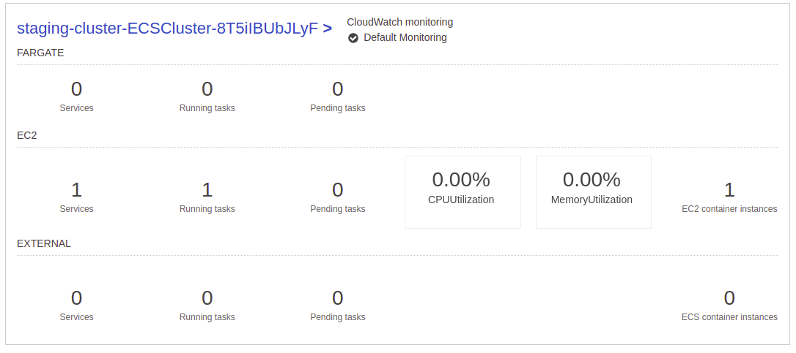
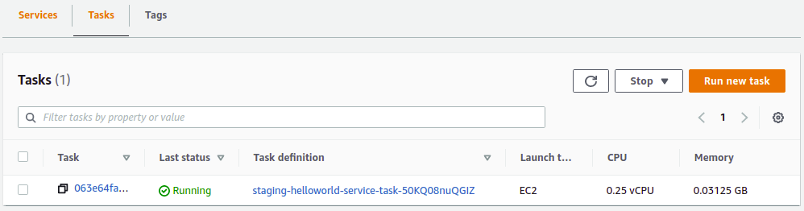

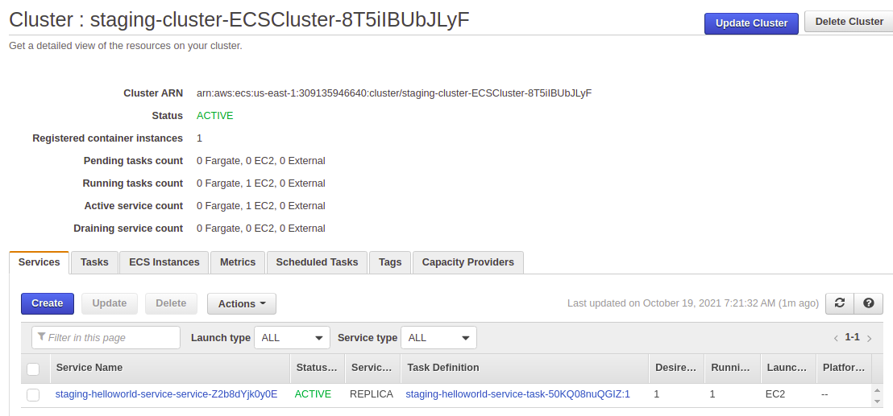
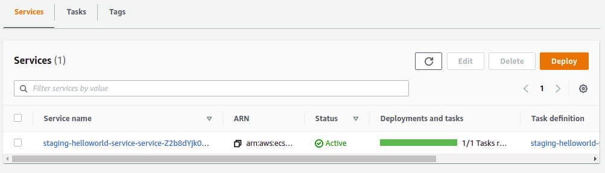

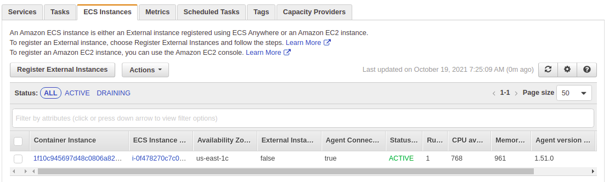


## Updating deployment on ECS containers

Steps,
- Make the changes in the helloworld code
- Log in to the ecr registry
- Build your Docker container
- Pick a new unique tag, and use it to tag your image "foobar"
- Push the image to the ecr repository
- Update the ECS service CloudFormation stack

Instances should be destroyed and recreated on the current TargetGroup using the new tag of the image

```js
%> eval "$(aws ecr get-login --region us-east-1 --no-include-email)" 

%> docker build -t helloworld .

%> docker tag helloworld 309135946640.dkr.ecr.us-east-1.amazonaws.com/helloworld:foobar

%> docker push 309135946640.dkr.ecr.us-east-1.amazonaws.com/helloworld:foobar
The push refers to repository [309135946640.dkr.ecr.us-east-1.amazonaws.com/helloworld]
123e4f70b9af: Pushed 
f2232579905e: Pushed 
b00a6a0c3766: Layer already exists 
...
foobar: digest: sha256:44a1b6f1bbb88a480b0112b1efab174e5df5c613b46703dacbad4d81905a074b size: 2840

%> aws cloudformation update-stack \
    --stack-name staging-helloworld-service \
    --capabilities CAPABILITY_IAM \
    --template-body file://helloworld-ecs-service.yaml \
    --parameters ParameterKey=Tag,ParameterValue=foobar
{
    "StackId": "arn:aws:cloudformation:us-east-1:309135946640:stack/staging-helloworld-service/8f622030-30d6-11ec-9046-0eca632f4781"
}

```

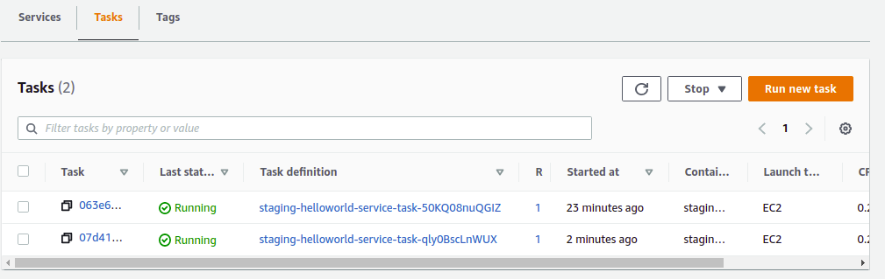
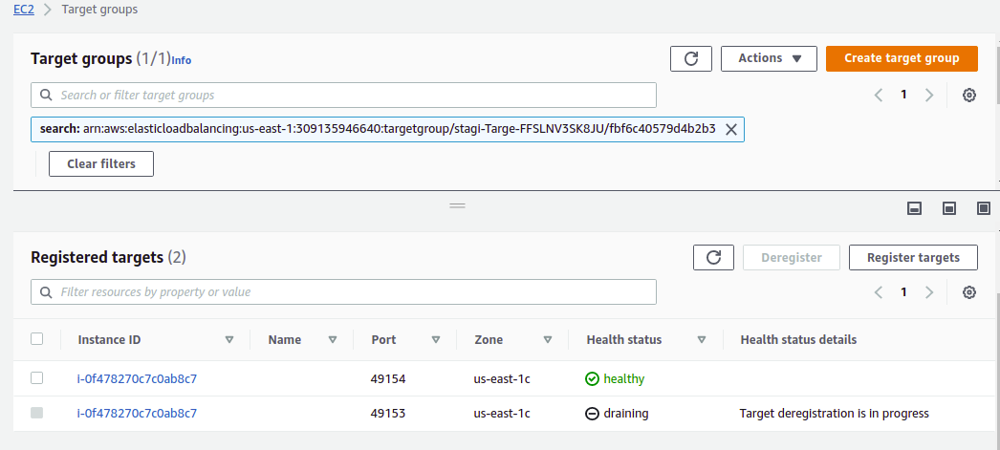

## Delete environment

If required, undo changes on helloworld app

```js
helloworld %>git checkout -f
```

For delete the complete environment, just execute the script

```js
%> ./stopEnv.sh
Deleting ECS Service ...
ECS Service deleted 

Deleting ALB ...
ALB deleted 

Deleting ECS Cluster ...
ECS Cluster deleted 

Deleting images on ECR ...
Deleting "latest"
"latest" deleted ...
Deleting "fromecs"
"fromecs" deleted ...
Deleting "foobar"
"foobar" deleted ...
ECR images deleted

Deleting ECR ...
ECR deleted 

```