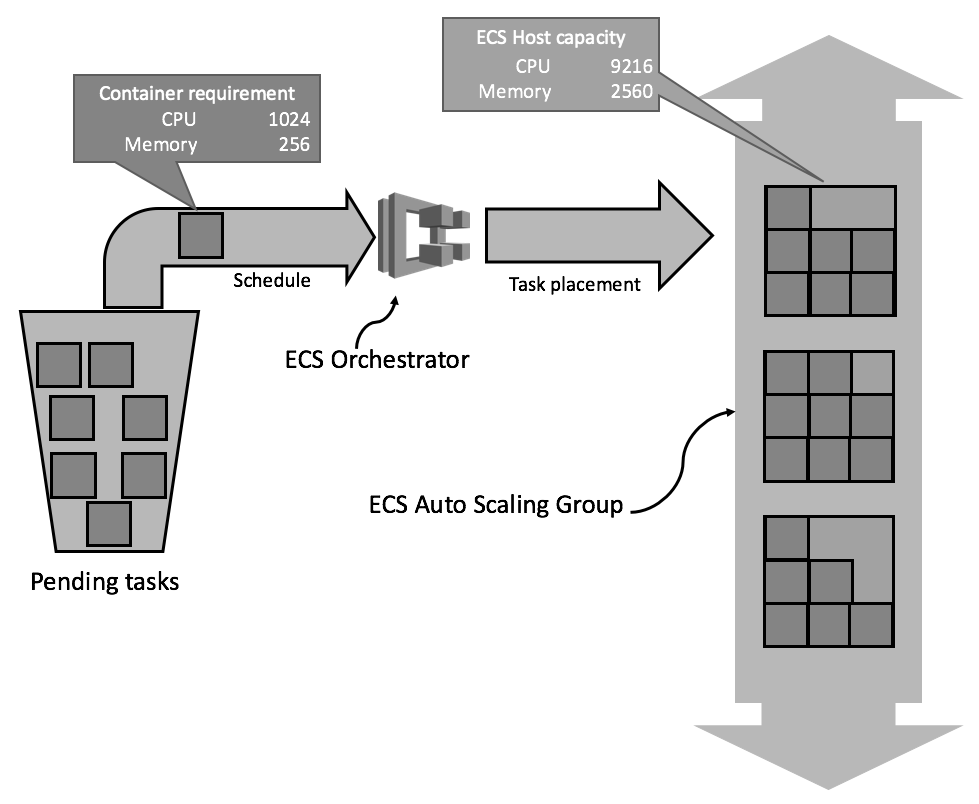

# Package our image on a Docker Container

References,
https://github.com/yogeshraheja/helloworld/blob/master/helloworld.js
https://github.com/yogeshraheja/helloworld/blob/master/package.json
https://github.com/yogeshraheja/helloworld/blob/master/Dockerfile
https://github.com/yogeshraheja/EffectiveDevOpsTemplates/blob/master/ecr-repository-cf-template.py
https://github.com/yogeshraheja/EffectiveDevOpsTemplates/blob/master/ecs-cluster-cf-template.py
https://github.com/yogeshraheja/EffectiveDevOpsTemplates/blob/master/helloworld-ecs-alb-cf-template.py
https://github.com/yogeshraheja/EffectiveDevOpsTemplates/blob/master/helloworld-ecs-service-cf-template.py
https://github.com/yogeshraheja/EffectiveDevOpsTemplates/blob/master/helloworld-codebuild-cf-template.py
https://raw.githubusercontent.com/yogeshraheja/EffectiveDevOpsTemplates/master/helloworld-ecs-service-cf-template.py
https://github.com/yogeshraheja/EffectiveDevOpsTemplates/blob/master/helloworld-codepipeline-cf-template.py

## Services to use
- Docker
- EC2
- ECS
- ALB
- CodeBuild
- CodePipeline

## Docker Installation
Documentation for docker installation [here](./DockerInstallationOnUbuntu.md)

## Application dockerization
Reference,
- official AWS Docker image. You can read more about this at http://amzn.to/2jnmklF.

Steps
- Pull alphine image from docker registry
- Run a container
- Search the image to be used on cli or web (https://hub.docker.com/_/node/.)
- Create a Dockerfile on helloworld project, on "dockerized" branch
- Build the image
- Run a docker from the created image
- Validate in logs container is running and using curl
- Kill the container

Detail [here](./DockerizingApplication.md)

## EC2

### Create a ECR repo

Steps,
- Create the Cloudformation script for the Registry 
- Create the Registry
- Get the exported variables of the stack

```js
%> cat ecr-repository-cf-template.py
%> python ecr-repository-cf-template.py > ecr-repository.yaml
%> aws cloudformation create-stack \
    --stack-name helloworld-ecr \
    --capabilities CAPABILITY_IAM \
    --template-body file://ecr-repository.yaml \
    --parameters \ ParameterKey=RepoName,ParameterValue=helloworld

%> aws ecr describe-repositories
{
    "repositories": [
        {
            "registryId": "094507990803",
            "repositoryName": "helloworld",
            "repositoryArn": "arn:aws:ecr:us-east-1:094507990803:repository/helloworld",
            "createdAt": 1536345671.0,
            "repositoryUri": "094507990803.dkr.ecr.us-east-1.amazonaws.com/helloworld"
        }
    ]
}

%> aws cloudformation list-exports
```

### Upload the image to ECR

Steps,
- Login to ECR
- Tag the image
- Push the image to the Registry
- Validate image is on the Registry

```js
%> eval "$(aws ecr get-login --region us-east-1 --no-include-email )"

%> cd helloworld

# Get url from "aws ecr describe-repositories" on repositoryUri, in example "094507990803.dkr.ecr.us-east-1.amazonaws.com/helloworld"
%> docker tag helloworld:latest 094507990803.dkr.ecr.us-east-1.amazonaws.com/helloworld:latest

%> docker push 094507990803.dkr.ecr.us-east-1.amazonaws.com/helloworld:latest

%> aws ecr describe-images --repository-name helloworld
{
    "imageDetails": [
        {
            "imageSizeInBytes": 265821145,
            "imageDigest": "sha256:95906ec13adf9894e4611cd37c8a06569964af0adbb035fcafa6020994675161",
            "imageTags": [
                "latest"
            ],
            "registryId": "094507990803",
            "repositoryName": "helloworld",
            "imagePushedAt": 1536346218.0
        }
    ]
}
```

### Creation of the ECS Cluster
ECS service provides an orchestration layer. That orchestration layer is in charge of managing the life cycle of containers, including upgrading or downgrading and scaling your containers up or down. The orchestration layer also distributes all containers for every service across all instances of the cluster optimally. Finally, it also exposes a discovery mechanism that interacts with other services such as ALB and ELB to register and deregister containers.

Instead, we are using an ECS- optimized AMI (you can read more about this at http://amzn.to/2jX0xVu) that lets us use the UserData field to configure the ECS service, and then starting it.

Containers, through the intermediary of their task definitions, set a requirement for CPU and memory. They will require, for example, 1024 CPU units, which represents one core, and 256 memory units, which means 256 MB of RAM. If the ECS instances are close to being filled up on one of those two constraints, the ECS Auto Scaling Group needs to add more instances:

ECS distribution of new containers on existing ECS instances


