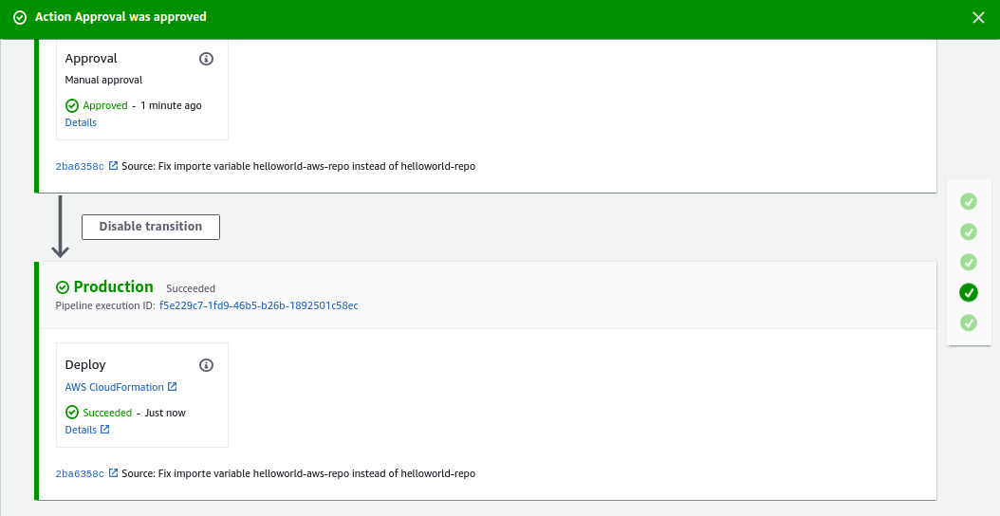

# ECS deployment using pipeline

Techinologies to use,
- CloudFormation
- ECS
- CodeBuild (Automating containers creation)
- CodePipeline
- CodeDeploy

It was reused all CF scripts an Shell scripts from example [ECS-ALB-DockerImage](./12ECS-ALB-DockerImage)

## Environment setup
Previos steps,
- Creation of Staging environment

New steps, creation of Production environment,
- Create new ECS Cluster for production
- Create new ALB for production
- Create new Service for production
- Test production deployment

All automated on [startEnv.sh](./startEnv.sh)

```js
%> python ecs-cluster-cf-template.py > ecs-cluster.yaml

%> aws cloudformation create-stack \
    --stack-name production-cluster \
    --capabilities CAPABILITY_IAM \
    --template-body file://ecs-cluster.yaml \
    --parameters ParameterKey=KeyPair,ParameterValue=EffectiveDevOpsAWS \
                 ParameterKey=VpcId,ParameterValue=vpc-e2f5139f \
                 ParameterKey=PublicSubnet,ParameterValue=subnet-29984808\\,subnet-67558238\\,subnet-e3445ddd\\,subnet-6a0c9627\\,subnet-586be756\\,subnet-5ec70d38

%> aws cloudformation wait stack-create-complete --stack-name production-cluster

%> aws cloudformation create-stack \
    --stack-name production-alb \
    --capabilities CAPABILITY_IAM \
    --template-body file://helloworld-ecs-alb.yaml

%> aws cloudformation wait stack-create-complete --stack-name production-alb

%> aws cloudformation create-stack \
    --stack-name production-helloworld-service \
    --capabilities CAPABILITY_IAM \
    --template-body file://helloworld-ecs-service.yaml \
    --parameters ParameterKey=Tag,ParameterValue=latest

%> aws cloudformation wait stack-create-complete --stack-name production-helloworld-service

#Test
%> serviceURL=$(aws cloudformation describe-stacks \
    --stack-name production-alb \
    --query 'Stacks[0].Outputs' | grep us-east-1.elb.amazonaws.com:3000 | awk 'BEGIN { FS = " " } ; { print $2}' | sed 's/\"//' | sed 's/\"//' | sed 's/,//')
#echo "aws cloudformation describe-stacks --stack-name production-alb --query 'Stacks[0].Outputs' | grep us-east-1.elb.amazonaws.com:3000 | awk 'BEGIN { FS = " " } ; { print $2}' | sed 's/\"//' | sed 's/,//'"
%> echo "curl $serviceURL"
%> curl $serviceURL

```

## Automating the creation of containers with CodeBuild

Instead of continue using public npm image and upload it to the ECR, we are going to build a new image using CodeBuild and this is the image we will upload to ECR.

CodeBuild
Uses a **buildspec** file for the image creation, this file has sections,
- pre_build:  Steps previous to build the image: 
  - Get pipeline state
  - Get pipeline execution id
  - Create build.json file with the build tag
  - Login to ECR
- build:      Image building: "docker build ..."
- post_build
  - Push image to ECR
  - Identify image on ECR
  - Tag the image to latest
- artifacts:  Files to upload to S3: build.json

```js
%> python helloworld-codebuild-cf-template.py > helloworld-codebuild.yaml

%> aws cloudformation create-stack \
    --stack-name helloworld-codebuild \
    --capabilities CAPABILITY_IAM \
    --template-body file://helloworld-codebuild.yaml

%> aws cloudformation wait stack-create-complete --stack-name helloworld-codebuild

%> aws cloudformation delete-stack --stack-name helloworld-codebuild
%> aws cloudformation wait stack-delete-complete --stack-name helloworld-codebuild
```

Instructions added to scripts [startEnv.sh](./startEnv.sh) and [stopEnv.sh](./stopEnv.sh) 

## Creating deployment pipeline with CodePipeline

For this action, CloudFormation script "helloworld-ecs-service.yaml" needs to be added to App source code project "helloworld".
"helloworld-ecs-service.yaml" creates our deployment/container on ECS using an specific Docker tag.

### Automated Actions,
- Add Container creation CF template to App source code
- Create CodePipline CF template 
  - Create S3 bucket
  - Define CodePipeline service role
  - Define Deploy stages role
  - Define Pipeline and Stages
    - Source stage: Download code and build App artifact, **No credentials specified, don't want to store clear in github**
    - Build stage: Call the CodeBuild stack "helloworld-codebuild", store Artifact tag.json file on BuildOutput
    - Staging stage: Call "helloworld-ecs-service.yaml" CF script for deploy the new image tag
    - Approval stage: Manual approval
    - Production stage: Call "helloworld-ecs-service.yaml" CF script for deploy the new image tag

### Manual Actions,
- Specify github credentials once Pipeline created on AWS CodePipeline console
  - Select pipeline created, Edit, Select stage, Edit, Click on gray icon, Click Connect to github right-hand-side menu
    - Action provider: Github (version 2)
    - Connection: esausi
    - Repository Name: helloworld
    - Branch name: dockerized
  - Select helloworld project and dockerized branch, Save

** CAPABILITY_NAMED_IAM used because defining custom names at the IAM level

## Code

```js
#ON HELLOWORLD
helloworld %> git branch
* dockerized
...
helloworld %> ls cf-templates
helloworld-ecs-service-cf-template.py
helloworld-ecs-service.yaml

#ON EXAPLES PROJECT
%> python helloworld-codepipeline-cf-template.py > helloworld-codepipeline.yaml

%> aws cloudformation create-stack \
    --stack-name helloworld-codepipeline \
    --capabilities CAPABILITY_NAMED_IAM \
    --template-body file://helloworld-codepipeline.yaml

%> aws cloudformation wait stack-create-complete --stack-name helloworld-codepipeline

%> aws cloudformation delete-stack --stack-name helloworld-codepipeline
%> aws cloudformation wait stack-delete-complete --stack-name helloworld-codepipeline
```

## Example execution

Files for previous example,
- startEnvUploadImage.sh
- testEnv.sh
- stopEnvUploadImage.sh

Create ECR, Upload the image, create container and ALB

File for current example,
- startEnv.sh
- testEnv.sh
- stopEnv.sh

Create ECR, Create CodeBuild task and CodePipeline pipeline, create container using CodeBuild and ALB


Once pipeline created, just connect to github and execute it, should be executed the pipeline until manual approval, once approved, should deploy to production as follow,



## Troubleshooting

### Insufficient permissions when executing CodePipeline pipeline
**Error**: Insufficient permissions
Unable to use Connection: arn:aws:codestar-connections:us-east-1:309135946640:connection/42122dee-fb1f-4d5f-b859-5e4ebbc323ab. The provided role does not have sufficient permissions.

**Analysis**: 
Reference: https://stackoverflow.com/questions/64298865/aws-codepipeline-source-action-has-insufficient-permissions-for-codestar-connec

**Solution**
- Add permisions to the role to use the connection
- Role used by codepipeline: AWS Console -> CodePipline Console -> Pipeline -> Select pipeline -> Settings: Service role ARN -> Select policy -> Edit policy -> JSON -> Go to the end and add

```js
,
        {
            "Action": "codestar-connections:UseConnection",
            "Resource": "arn:aws:codestar-connections:us-east-1:309135946640:connection/42122dee-fb1f-4d5f-b859-5e4ebbc323ab",
            "Effect": "Allow"
        }
```

Save and execute the pipeline again using "Retry" button

### Repository does not exist in the registry, when creating Image
**Error**: name unknown: The repository with name 'helloworld-aws' does not exist in the registry with id '309135946640'

[Container] 2021/10/28 12:08:20 Command did not exit successfully docker push "$(cat /tmp/build_tag.txt)" exit status 1
[Container] 2021/10/28 12:08:20 Phase complete: POST_BUILD State: FAILED
[Container] 2021/10/28 12:08:20 Phase context status code: COMMAND_EXECUTION_ERROR Message: Error while executing command: docker push "$(cat /tmp/build_tag.txt)". Reason: exit status 1

**Analysis**: The only existing ECR is "helloworld", so it is needed to create a new one called "helloworld-aws"

**Solution**: Create the new repo

```js
aws cloudformation create-stack \
    --stack-name helloworld-ecr-aws \
    --capabilities CAPABILITY_IAM \
    --template-body file://ecr-repository.yaml \
    --parameters ParameterKey=RepoName,ParameterValue=helloworld-aws
aws cloudformation wait stack-create-complete --stack-name helloworld-ecr-aws
```

### Requested image not found when Pushing image to Registry
**Error** Stopped | CannotPullContainerError: Error response from daemon: manifest for 309135946640.dkr.ecr.us-east-1.amazonaws.com/helloworld:90aa70e42ab99116193662d301c8ee2a592d271e not found: manifest unknown: Requested image not found

**Analysis**: Script which is creating the container is helloworld/cf-template/helloworld-ecs-service.yaml
Here, it is using exported variable "helloworld-repo" for recover repo name from ECR stack
- Original variable used:  helloworld-repo=helloworld
- Variable should be used: helloworld-aws-repo=helloworld-aws

**Solution**
So needed to change value on script, commit and push changes to helloworld and execute again stage on pipeline

### Error because of permissions when trying to delete service stack
**Error** Error when trying to delete Service, HelloWorld Role on Delete policy does not have permissions for delete the Stack

**Analysis** Reviewd and Roles does not exists

**Solution** Create the role
Entity: CloudFormation
Permissions
- EC2 Full permissions
- ECS Full permissions
