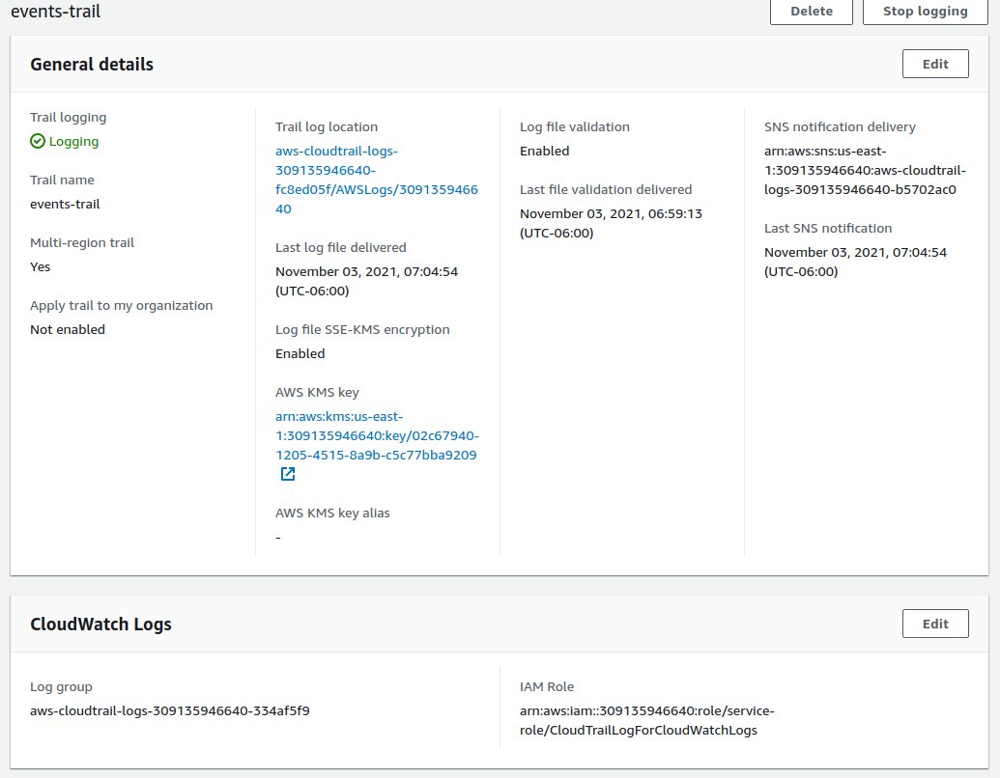
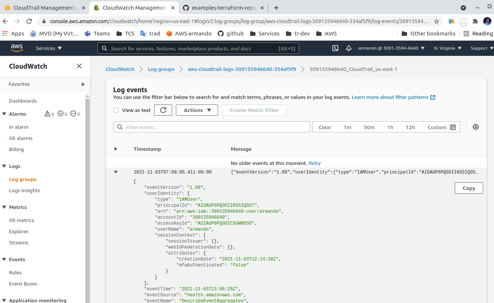
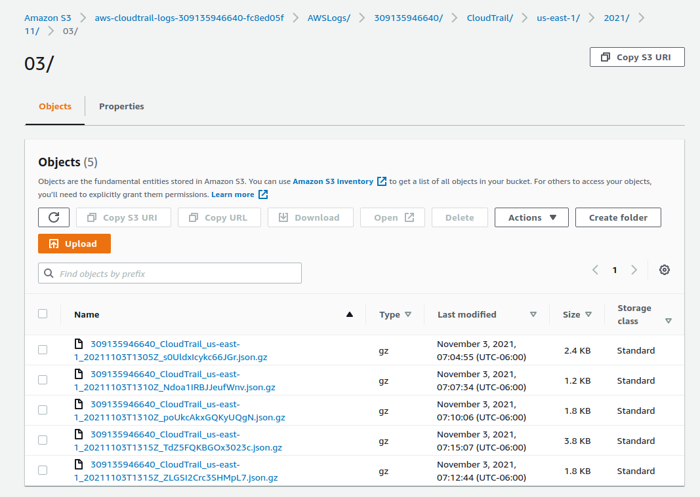
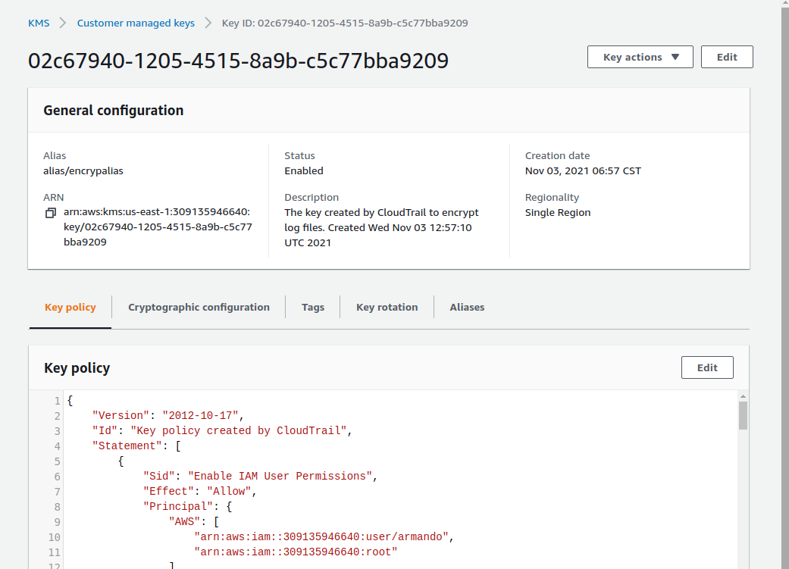

# CloudTrail

Reference,
- https://docs.aws.amazon.com/awscloudtrail/latest/userguide/cloudtrail-create-a-trail-using-the-console-first-time.html

Record all events on AWS APIs

## Trail on S3
For monitoring administrative actions on AWS account, configure CloudTrail for send events to S3 bucket

Resources crated,
- CloudTrail Trail
- AWS KMS key
- S3 bucket
- SNS topic
- CloudWatch logs group
- IAM Role for CloudWatch
- IAM Role for S3

### CloudTrail

### CloudWatch

### S3

[Log file](./logs/309135946640_CloudTrail_us-east-1_20211103T1305Z_s0UldxIcykc66JGr.json)

### KMS

[Key policy](./kms-key-policy.json)