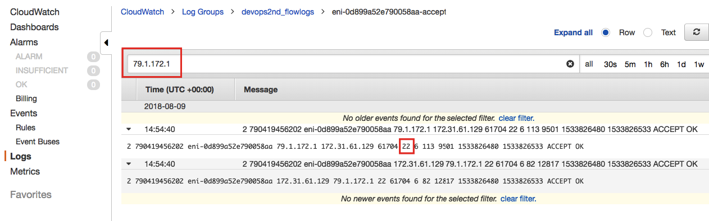

# VPC Flow Logs

## Configuration

Steps,
- An empty CloudWatch group, where the data will be stored
- An AWS role to perform the VPC Flow Log operation
- A policy associated with the role, with the necessary permissions 

Automation will be created with terraform.

Once resources created, neccessary to create FlowLog for one subnet
- AWS Console -> VPC Console -> Subnets -> Select a subnet -> Create flow log
  - Filter: Accept
  - Send to CloudWatch logs: Selected
  - Destination log group: devops2nd_flowlogs
  - IAM role: devops2nd_flowlogs
- Create a EC2 instance on same subnet

AWS Console -> AWS CloudWatch Console -> Log Groups -> Select devops2nd_flowlogs -> Select devops2nd_flowlogs
- Log Streams: Select ENI from the EC2 instance

**Analysis**

Reference,
https://docs.aws.amazon.com/AmazonVPC/latest/UserGuide/flow-logs.html#flow-log-records:

- Recover your IP: http://www.whatsmyip.org/
- Identify traffic from this IP and 22 port 



Values,
- The public IP of my laptop is 79.1.172.1
- The private IP of the EC2 instance is 172.31.61.129
- The source port of my laptop is 61704
- The destination port of the EC2 instance for the SSH service is port 22

```js
%> cat vpcflowlogs.tf
module "flow-log-prerequisite" {
   #source = "github.com/giuseppeborgese/effective_devops_with_aws__second_edition//terraform-modules//vpc-flow-logs-prerequisite"
   source = "github.com/esausi/effective_devops_with_aws__second_edition//terraform-modules//vpc-flow-logs-prerequisite"
   prefix = "devops2nd"
 }

output "role" { 
    value = "${module.flow-log-prerequisite.rolename}" 
}

output "loggroup" { 
    value = "${module.flow-log-prerequisite.cloudwatch_log_group_arn}" 
}

%> terraform init -upgrade

%> terraform plan -out plan.out

%> terraform apply plan.out
...
Apply complete! Resources: 3 added, 0 changed, 0 destroyed.

Outputs:

loggroup = "arn:aws:logs:us-east-1:309135946640:log-group:devops2nd_flowlogs"
role = "devops2nd_flowlogs"
```


## Troubleshoot

### Error: Missing required argument
│ 
│ The argument "region" is required, but was not set.

**Solution,**
- set the environment variable AWS_DEFAULT_REGION
- test configuration defining region variable on aws provider
  - Create test/simple/test.tf file
  - Add this code to the file 

  ```js
provider "aws" {
  region = "us-east-1"
}

module "under_test" {
  source = "../.."

  # Any arguments the module requires
}
  ```

  and validate the module

  ```js
%> cd tests/simple
test/simple %> terraform init
test/simple %> terraform validate
Success! The configuration is valid.
  ```