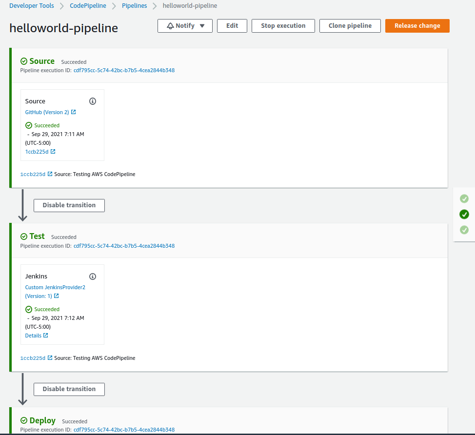

# CodeDeploy + CodePipeline + Jenkins

AWS CodePiline reference,
- https://docs.aws.amazon.com/codepipeline/latest/userguide/tutorials-four-stage-pipeline.html

## Prepare the environment
Execute shell script **startenv.sh 9**
this is going to create
- Jenkins instance
- stating instance: Staging environment for test app
- production instance: Instance for deploy final app

Next actions required,
- Prepare Jenkins: For more detail look detail [here](./README.md)

## Configuration

Steps,
- Start all environment: jenkins + stating + pro
- Get ARN
- Create deployment group
- Add Deployment to Pro adding "approval" stage to the pipeline
  - Create a new SNS topic for receive notifications, subscribe and confirm subscription
  - Add new Manual Approval stage to the pipeline
  - Add new AWS CodeDeploy stage to the pipeline
  
  - Save and Release change
- Approve the deployment on console or by email link
 
 
 
 

```js
%> ./startenv.sh 9
Starting all
Started ...

%> arn=$(aws deploy get-deployment-group \
           --application-name helloworld \
           --deployment-group-name staging \
           --query 'deploymentGroupInfo.serviceRoleArn')

%> aws deploy create-deployment-group \
    --application-name hellonewworld \
    --ec2-tag-filters Key=aws:cloudformation:stack-name,Type=KEY_AND_VALUE,Value=production \
    --deployment-group-name production \
    --service-role-arn arn:aws:iam::309135946640:role/CodeDeployServiceRole

%> aws deploy list-deployment-groups \
    --application-name hellonewworld

%> aws sns create-topic --name production-deploy-approval
{
    "TopicArn": "arn:aws:sns:us-east-1:309135946640:production-deploy-approval"
}

%> aws sns subscribe \
    --topic-arn arn:aws:sns:us-east-1:309135946640:production-deploy-approval \
    --protocol email \
    --notification-endpoint armando.martinez.esausi@gmail.com

```

## Test complete pipeline
For test complete pipeline, just commith a change on helloworld project
git@github.com:esausi/helloworld.git

Once committed and pushed, you should see "helloworld-pipeline" CodePipeline starts, 


Summary of events that happen until this point,

### Environment setup
Components setup and used until now
- Github project for WebApp
- Github project for Ansible installations: Jenkins+nodejs+mocha, nodejs+codedeployagent
- Gitbub project for documentation (this repo)
- Jenkins instance with CodePipeline plugin and Jenkins Job using it
- Linux instance with nodejs and codedeploy agent for Test stage
- Linux instance with nodejs and codedeploy agent for Production stage
- AWS CodePipeline pipeline with Source, Test, Deploy and Production stages

### Pipeline behind scenes steps
- Github project recives a commit+push
- CodePipeline which is observing the Githup repo, detects the change and launch the pipeline
- CodePipeline launchs Source stage, downloads the code and creates a zip on S3 repo
- CodePipeline launchs Test stage, launch Jenkins Job
- Jenkins Job receives an execution, Install source code on workspace and launch test, at the end notifies to CodePipeline completion
- CodePipeline receives notification, launch Deploy stage
- CodePipeline using the codedeploy agent installed on staging instance start to send instructions
- codedeploy agent execute events defined on appspec.yml file
  - Copy application files: /scripts/helloworld-daemon.service, ./helloworld.js
  - BeforeInstall: scripts/stop.sh, scripts/setup.sh, O.S service setup
  - ApplicationStart: scripts/start.sh, O.S service start
  - ValidationServer: scripts/validate.sh, App testing using curl command
- CodePipeline hold on waiting Manual approval for Production deployment
  - Enter to the console and Review the Approval
- CodePipeline receives notification, launch Pro stage
- CodePipeline using the codedeploy agent installed on production instance start to send instructions
- codedeploy agent execute events defined on appspec.yml file
- SNS mail notification informing pipeline result

## Troubleshooting

**Issue: ERROR DETAIL**
Test stage defined on AWS CodePipeline
Job defined on Jenkins
Once ASW CodePipeline executed, Jenkins Job is never executed
**Solution**: 
- Solution detaul


