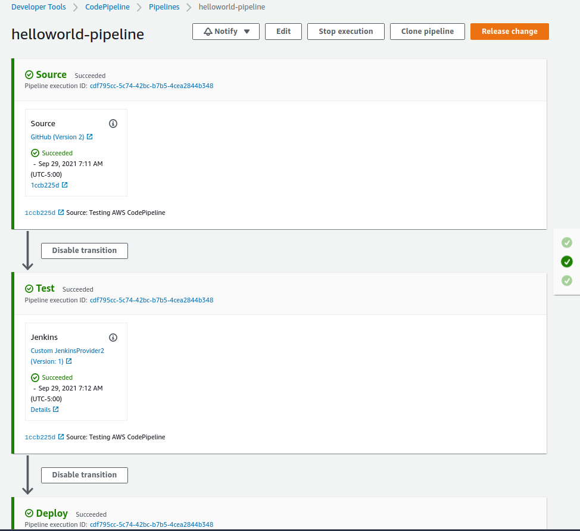

# CodeDeploy + CodePipeline + Jenkins

AWS CodePiline reference,
- https://docs.aws.amazon.com/codepipeline/latest/userguide/tutorials-four-stage-pipeline.html

Now is time to integrate Codepipeline with Jenkins, for do this it is neccessary,
- Change IAM Instance role for integrate with CodePipeline
- Create/Update Jenkins instance for update the changes
  - If creating new instance, 
    - Download jenkins backup tar.gz file and extract to root jobs, secrets, credentials.xml and periodicbackup.xml 
    - Start jenkins console on navigator using: hppt://jenkins.esausi.com:8080/
    - Install secret key
    - Install default plugins
    - Create user
    - Restart Jenkins, "http://jenkins.esausi.com:8080/restart"
- Install plugins
  - CodePipeline plugin on Jenkins: "CodePipeline"
  - Locale (idiom), configure as "en_US" and mark **"Force to use this landguage"**
- Create a Jenkins Job for the required processing: **Job should be on root (CodePipeline does not support folders)**
  - Name: HelloworldTest
  - Type: Freestyle, and OK
  - SCM: AWS CodePipeline
    - AWS Region: us-east-1
    - Category: Test
    - Provider: JenkinsProvider
  - Build Triggers: Poll SCM
    - Shedule: * * * * *
      Required to define each minute, **if CodePipeline through something, it is going to wait this time for been executed**
  - Build section: Add build step, Execute shell
    - Command: npm config set registry http://registry.npmjs.org/
               npm install 
               ./node_modules/mocha/bin/mocha
  - post-build action: AWS CodePipeline Publisher
    - Add and leave the location blank. This configuration is the default. It will create a compressed file at the end of the build process.
- Edit Pipeline for integrate a new CodePipeline stage
  - AWS Console -> CodePipeline Console -> Pipeline -> Pipelines -> "helloworld-pipeline" and Edit
    - Add Stage using "+" symbol between Source and Deploy, give name "Test"
    - Add action group 
      - Name: Jenkins
      - Test provider: Add Jenkins, **Be sure is of type "Test"**
        - Provider name: Jenkins
        - Server URL: http://jenkins.esausi.com:8080
        - Project name: HelloworldTest
        Press "DONE", "Save" and "Release change"
- Start the node for the deployment, "staging" Deployment group **before you launch the pipeline**

Tips for validate Test Stage on CodeDeploy
- On Exclamation mark,
  Input artifact: SourceArtifact
  Output artifact: OutputTest
  ProjectName: HelloworldTest
- On Edit action,
  Action name: Jenkins
  Action provider: Test/Add Jenkins
  Input artifacts: SourceArtifact
  Provider name: JenkinsProvider
  Server URL: http://jenkins.esausi.com:8080
  Project name: HelloworldTest
  Variable namespace: 
  Output artifacts: OutputTest


## Configuration

```js
%> cat jenkins-cf-template.py
...
t.add_resource(IAMPolicy(
    "Policy",
    PolicyName="AllowsCodePipeline",
    PolicyDocument=Policy(
        Statement=[
            Statement(
                Effect=Allow,
                Action=[Action("codepipeline", "*")],
                Resource=["*"]
            )
        ]
    ),
    Roles=[Ref("Role")]
))
...

%> python jenkins-cf-template.py > jenkins-cf.yaml

%> aws cloudformation create-stack \
      --capabilities CAPABILITY_IAM \
      --stack-name jenkins \
      --template-body file://jenkins-cf.yaml \
      --parameters ParameterKey=KeyPair,ParameterValue=EffectiveDevOpsAWS \
                   ParameterKey=HostedZone,ParameterValue=esausi.com

%> aws cloudformation wait stack-create-complete \
      --stack-name jenkins

%> aws cloudformation describe-stacks \
      --stack-name jenkins \
      --query 'Stacks[0].Outputs[0]'

%> aws cloudformation update-stack \
      --capabilities CAPABILITY_IAM \
      --stack-name jenkins \
      --template-body file://jenkins-cf.yaml \
      --parameters ParameterKey=KeyPair,ParameterValue=EffectiveDevOpsAWS \
                   ParameterKey=HostedZone,ParameterValue=esausi.com

%> aws cloudformation wait stack-update-complete \
      --stack-name jenkins    

%> aws cloudformation delete-stack \
      --stack-name jenkins 

%> aws cloudformation wait stack-delete-complete \
      --stack-name jenkins  

# Start the node for deployment on a stack called staging

%> python nodeserver-cf-template.py > nodeserver-cf.yaml

%> aws cloudformation create-stack \
      --capabilities CAPABILITY_IAM \
      --stack-name staging \
      --template-body file://nodeserver-cf.yaml \
      --parameters ParameterKey=KeyPair,ParameterValue=EffectiveDevOpsAWS \
                   ParameterKey=HostedZone,ParameterValue=esausi.com \
                   ParameterKey=InstanceDNSRecordName,ParameterValue=nodeserver

%> aws cloudformation wait stack-create-complete \
      --stack-name staging
```

## Test complete pipeline
For test complete pipeline, just commith a change on helloworld project
git@github.com:esausi/helloworld.git

Once committed and pushed, you should see "helloworld-pipeline" CodePipeline starts, 


Summary of events that happen until this point,

### Environment setup
Components setup and used until now
- Github project for WebApp
- Github project for Ansible installations: Jenkins+nodejs+mocha, nodejs+codedeployagent
- Gitbub project for documentation (this repo)
- Jenkins instance with CodePipeline plugin and Jenkins Job using it
- Linux instance with nodejs and codedeploy agent
- AWS CodePipeline pipeline with Source, Test and Deploy stages

### Pipeline behind scenes steps
- Github project recives a commit+push
- CodePipeline which is observing the Githup repo, detects the change and launch the pipeline
- CodePipeline launchs Source stage, downloads the code and creates a zip on S3 repo
- CodePipeline launchs Test stage, launch Jenkins Job
- Jenkins Job receives an execution, Install source code on workspace and launch test, at the end notifies to CodePipeline completion
- CodePipeline receives notification, launch Deploy stage
- CodePipeline using the codedeploy agent installed on staging instance start to send instructions
- codedeploy agent execute events defined on appspec.yml file
  - Copy application files: /scripts/helloworld-daemon.service, ./helloworld.js
  - BeforeInstall: scripts/stop.sh, scripts/setup.sh, O.S service setup
  - ApplicationStart: scripts/start.sh, O.S service start
  - ValidationServer: scripts/validate.sh, App testing using curl command


## Troubleshooting

**Issue: Test stage defined, and executed but nothing happens on Jenkins**
Test stage defined on AWS CodePipeline
Job defined on Jenkins
Once ASW CodePipeline executed, Jenkins Job is never executed
**Solution**: 
- Validate Test stage is from Action provider type **Test/Add Jenkins** and not **Build/Add Jenkins**
- Port 80 and 8080 should be oppened on Jenkins 

**Issue: Jenkins Job is launched but Node is failing with error** 

```js
+ ./node_modules/mocha/bin/mocha
/var/lib/jenkins/jobs/HelloworldTest/workspace/node_modules/mocha/lib/errors.js:180
const MOCHA_ERRORS = new Set(Object.values(constants));
                                    ^

TypeError: Object.values is not a function
    at Object.<anonymous> (/var/lib/jenkins/jobs/HelloworldTest/workspace/node_modules/mocha/lib/errors.js:180:37)
```

**Solution**: 
the node packages that are being installed are latest, not compatible with the current test app, it is required to customize on this way
- Navigate to: Jenkins Console -> Jenkins Job -> Build shell script
  Change the script to,

```js
npm config set registry http://registry.npmjs.org/
npm install mocha@2.5.3 --save-dev
npm install zombie --save-dev
npm install 

./node_modules/mocha/bin/mocha
```

